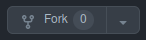

> ## TD 6 - Volumes, bind mounts & tmpfs mounts
Using Volumes and Bind Mounts:

## Part 1: Without using docker-compose

## Step 1:

Add to your application a feature, which reads a text file on your host and shows the content on a web page. Any changes in the content of this file should be shown by refreshing the web page. (by using a bind mount) 

The content of this file can for example explain the benefits of using docker volumes!

## Step 2:

Make your database persistent. (by using Volume)

Explain how you can migrate it! How to share it with another instance of the same database engine.

## Part 2: By using docker-compose 

Do both steps by using docker-compose and show your docker-compose.yaml and its changes!

Document your work and comment every command and step

> ## 👷 Prerequisites

1. Have a Github account properly setup with your local Git
   > You should use ssh authentication between your local git and
   Github. **[How to set it up](https://help.github.com/articles/connecting-to-github-with-ssh)**

2. **Fork** the repository

   

3. **Clone** your fork locally
    ```shell
    cd /path/to/workspace 
    git clone git@github.com:YOUR_USERNAME/TD7A4.git
    ```

4. Have Docker installed on your computer.

5. Execute the command line 'docker-compose up'
    ```shell
    docker-compose up
    ```
6. Check the result, `🚀 It Works!`
